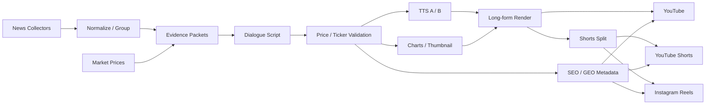

# Auto YouTube Market Pipeline

미국 시장 뉴스와 가격 데이터를 바탕으로 한국어 대화형 롱폼, Shorts, Instagram
Reels를 자동 제작·게시하는 파이프라인의 공개 구조입니다.

## 핵심 원칙

- 종가 등락과 시간외 등락을 별도로 저장합니다.
- 대본·자막·차트는 동일한 회차 가격 snapshot을 사용합니다.
- 티커, 숫자, 상승·하락 방향이 다르면 게시를 중단합니다.
- 숏폼은 주제 단위로 분리하고 해당 구간에 등장한 키워드만 사용합니다.
- 제목·설명·태그·해시태그는 대본 근거 안에서 자동 생성합니다.

이 저장소는 구조 공유용입니다. API 키, OAuth 토큰, Telegram 세션, 실제 채널 목록,
원문 DB, 음성 원본, 모델, 영상과 내부 운영 임계값은 포함하지 않습니다.

자세한 흐름은 [아키텍처](docs/ARCHITECTURE.md), 공개 범위는
[보안 문서](docs/SECURITY.md)를 참고하세요.

## 사용 기술

- 대본: LLM 기반 Story Packet → A/B 친구 대화 생성
- 음성: `Qwen3-TTS 0.6B Base` Voice Clone, A/B 고정 음색
- 대체 음성 후보: `GPT-SoVITS`
- 입 모양: `Rhubarb Lip Sync`
- 영상 조합: `FFmpeg`
- 차트·지수판·썸네일: Python, Pillow, 시장 데이터 API
- 수집: Telegram 클라이언트, 웹 수집기, YouTube 자막 수집기
- 게시: YouTube Data API, Instagram Graph API
- 실행: Windows Task Scheduler, 단계별 영수증과 재시작 지점

구체적인 모델과 역할은 [기술 스택](docs/TECH_STACK.md), 단계별 데이터 흐름은
[상세 파이프라인](docs/PIPELINE.md)을 참고하세요.

